# RMUL 决策树方案拆解

**目录**
- [RMUL 决策树方案拆解](#rmul-决策树方案拆解)
  - [0. 前言](#0-前言)
  - [1. 顶层](#1-顶层)
  - [2. Initialize 子树](#2-initialize-子树)
  - [3. Behave 子树](#3-behave-子树)
  - [4. ModeSelect 子树](#4-modeselect-子树)
  - [5. SubmodeCheck 子树](#5-submodecheck-子树)
  - [6. Execute 子树](#6-execute-子树)
  - [7. 总结](#7-总结)

## 0. 前言
本文档将 **自顶向下** 按 **执行顺序** 与 **模块化** 的方式讲解 Transistor 战队的 rmul 决策树的构成，方便之后的修正与优化，同时为新人快速熟悉本战队的决策方式提供帮助。

    *注：该文档应与决策树实时同步，请修改决策树的同事同步修改文档，说明功能变化。在自己新加入的功能处标记"(NEW)"，稳定/DEBUG后可删去。
      
    示例：(NEW)确定开始后，发布小陀螺的转速。

## 1. 顶层

    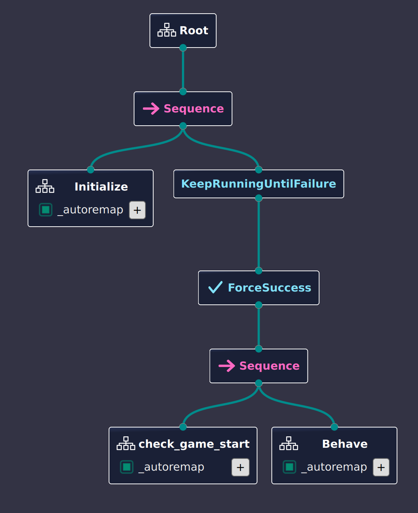
         
    
顶层

 

顶层由根节点开始，发送滴答 (Tick)，进入 Sequence 节点，开始依序处理子节点。

!!! note
    Sequence 依序执行子节点（左到右）：当前子节点成功则继续，失败则本滴答返回 FAILURE，下一滴答从第一个子节点重来。进入滴答时处于 RUNNING，全部成功后返回 SUCCESS，否则保持/返回 FAILURE。

    

    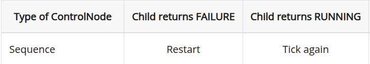
    
    
Sequence

    

 

进入 Initialize 节点并返回成功后，滴答将进入 KeepRunningUntilFailure 与 ForceSuccess 的组合节点。显然该组合将永远返回 RUNNING 状态，使 Sequence 保持进入该子节点，实现 **只进入一次 Initialize** 的功能。

接着进入第二个主序列，首先检查 check_game_start节点, 确定比赛是否在进行。如果是，进入 Behave子树，即行为树的主体，至此顶层结束。

## 2. Initialize 子树

    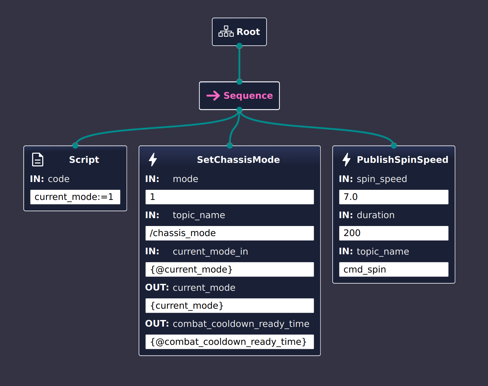
     
    
Initialize

 

本实现中，初始化序列包含三步：

1. 将当前模式写入黑板 `current_mode:=1`，确保后续节点在统一初始态下运行。
2. 调用 `SetChassisMode(mode=1)` 切换到底盘跟随模式，并记录冷却时间戳，用于战斗模式退出后的保护期。
3. 发布小陀螺转速 `PublishSpinSpeed(7.0, 200 ms)`，完成开局状态设定。

## 3. Behave 子树

    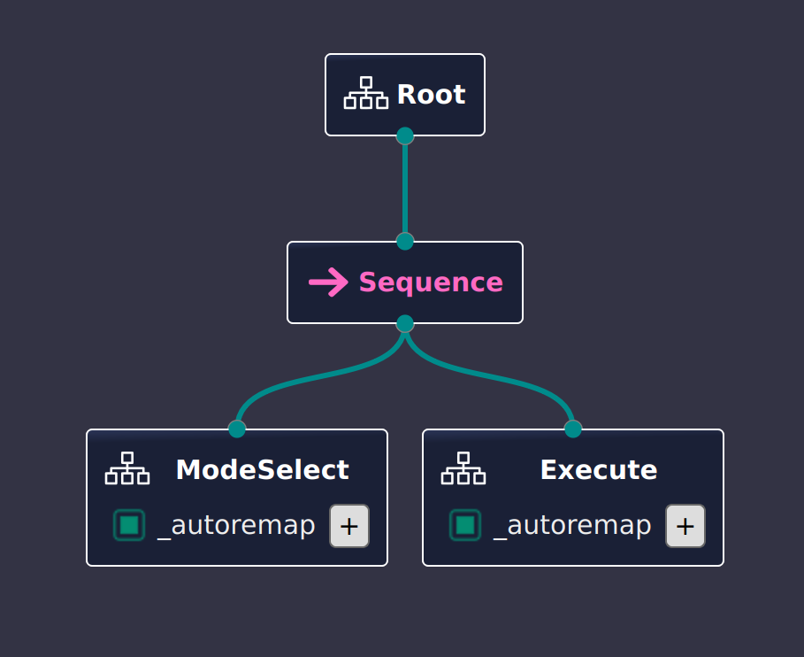
     
    
Behave

 

Behave 是顶层进入比赛后的主体序列：先由 ModeSelect 判定当前作战模式，再进入 Execute 执行对应策略。整个序列只要任一步失败（例如模式判定不满足前置条件），本滴答返回 FAILURE，下一滴答会重新判定模式。

## 4. ModeSelect 子树

    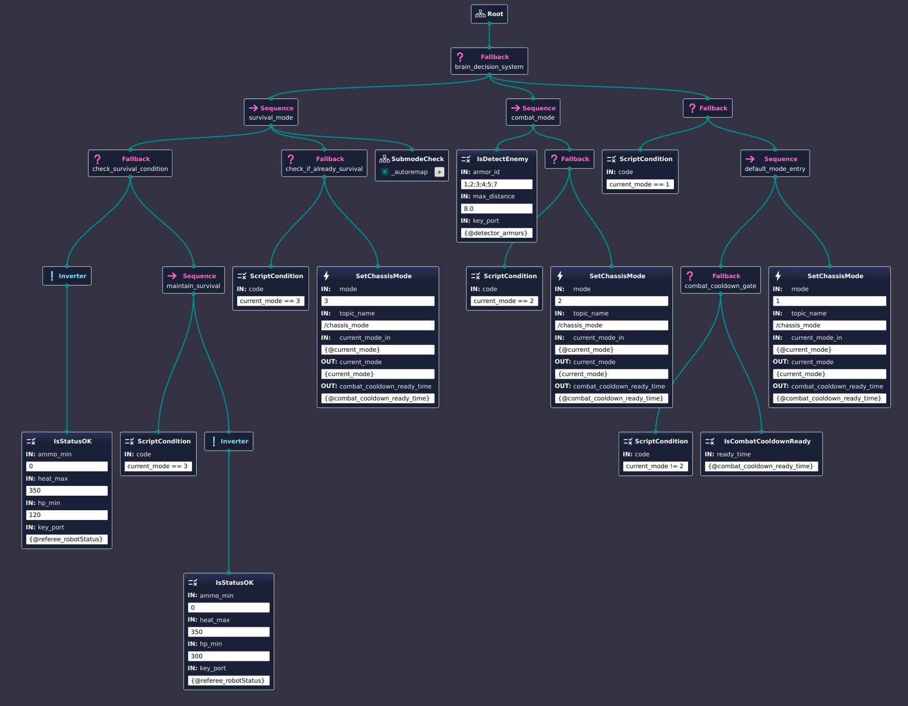
     
    
ModeSelect

 
ModeSelect 由 Fallback 构成，优先级从高到低：

!!! note
    Fallback 从左到右依次尝试子节点，遇到第一个返回 SUCCESS 或 RUNNING 的分支即停止评估，其余分支本滴答不再执行；若所有分支都失败，整体返回 FAILURE。这样高优先级模式总是先占用滴答的执行权。

    

    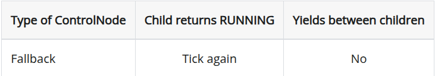
     
    
ModeSelect

    

- 生存模式 (mode=3)：检测血量/弹药不足或已在生存模式时触发。需要进入时，切到 `mode=3` 并下潜 SubmodeCheck 获取子模式。
 
    

        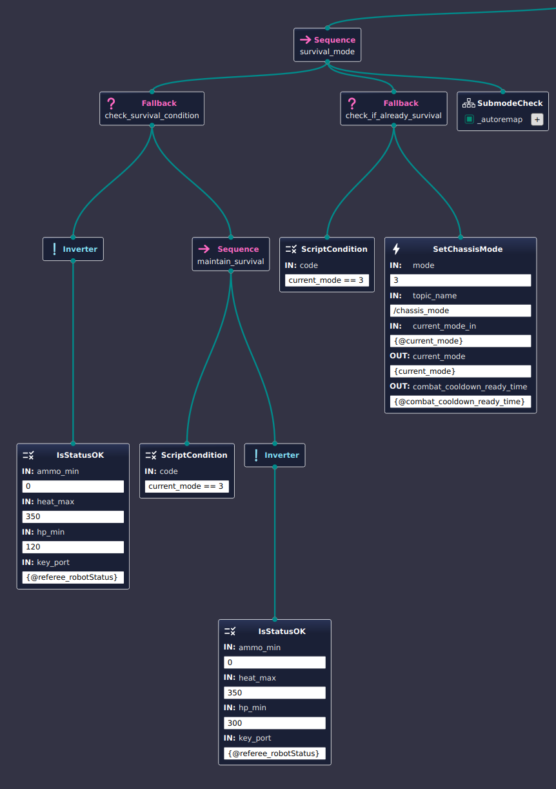
         
        
Survival Mode

    

!!! tip
     生存模式采用**滞回**：当血量低于 120 触发生存，只有血量恢复到 300 及以上才退出，避免在 120–300 区间反复切换。
 

- 战斗模式 (mode=2)：侦测到敌人时进入。若当前不在战斗态，则切换 `mode=2` 并记录冷却时间。
 
    

        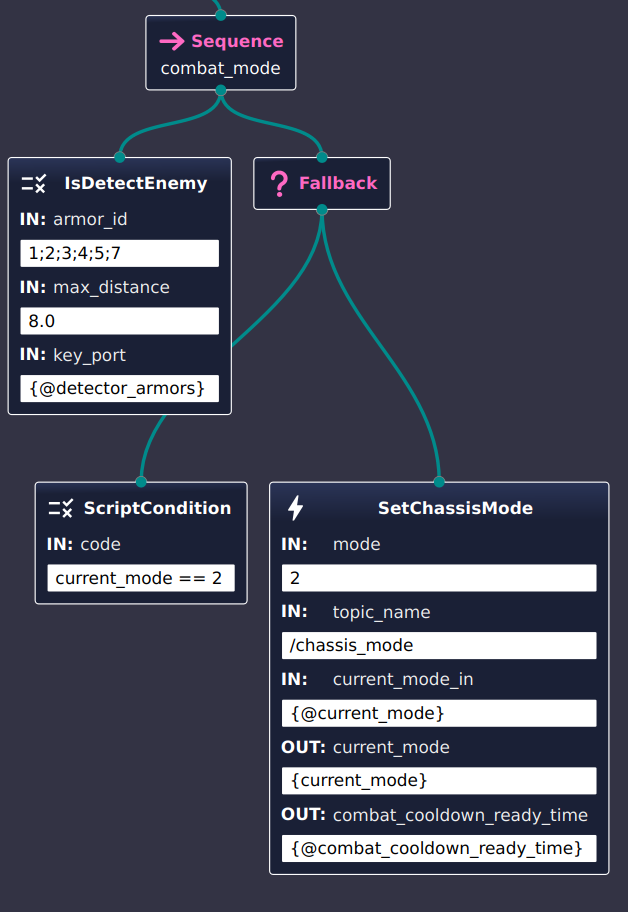
         
        
Combat Mode

    

 

- 默认模式 (mode=1)：前两分支都未命中且满足冷却门控时，切换或维持 `mode=1`。
 
    

        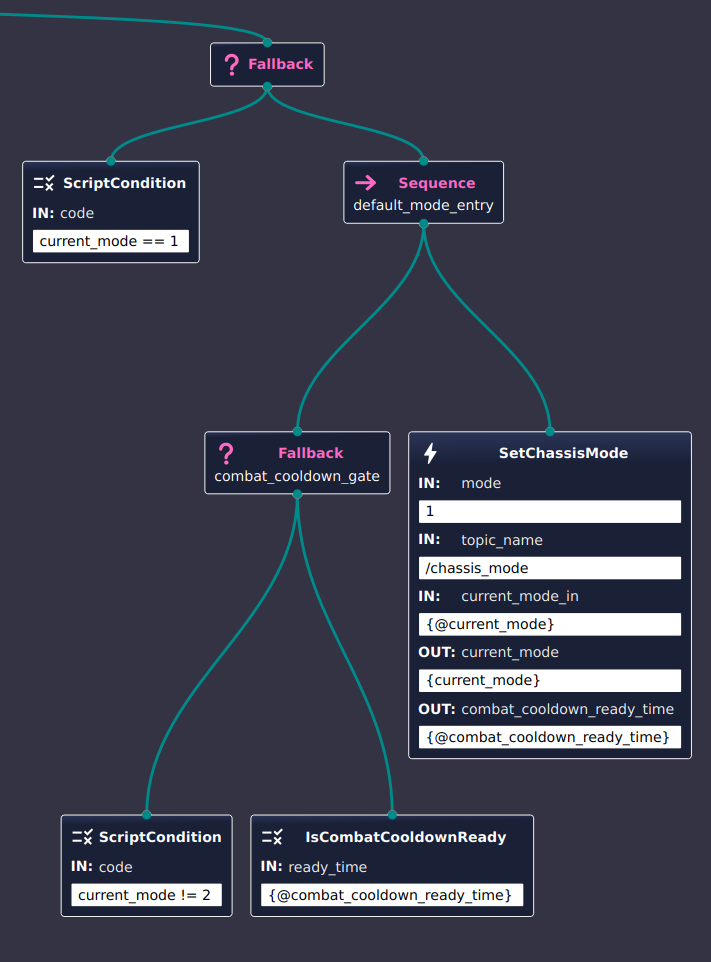
         
        
Default Mode

    

Fallback 会在首个成功或运行中的分支处停止评估，保证高优先级模式先行。

## 5. SubmodeCheck 子树

    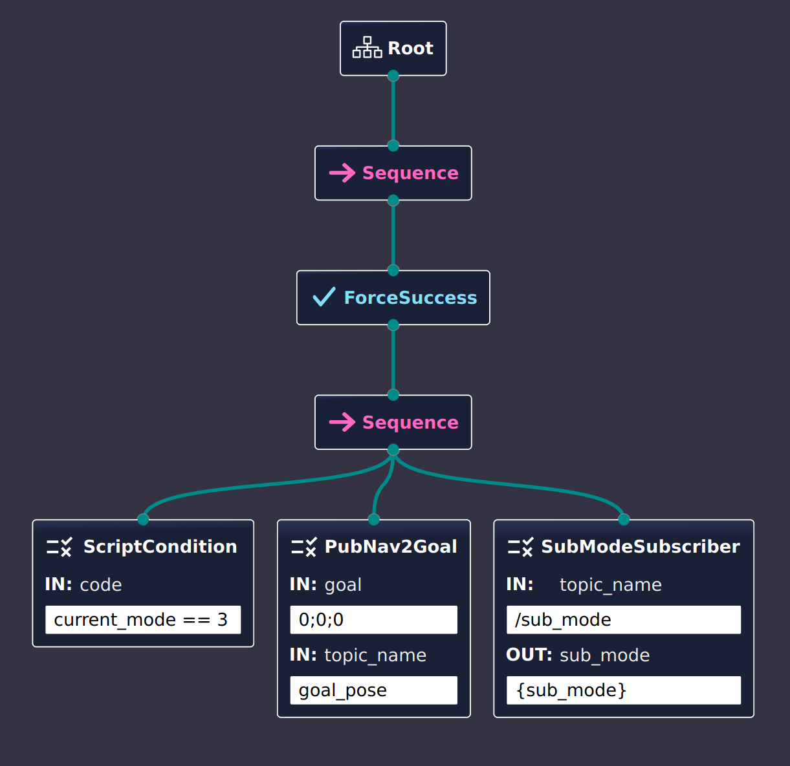
     
    
SubmodeCheck

 

SubmodeCheck 是生存模式下的补充：在 ForceSuccess 包裹的序列里，若当前模式为生存，则先清空导航目标，再订阅 `/sub_mode` 写入黑板 `sub_mode`，保证后续执行阶段能区分子模式（如补给/逃脱）。ForceSuccess 让该检查不会阻断上层流程，即便订阅失败也返回 SUCCESS。

## 6. Execute 子树

    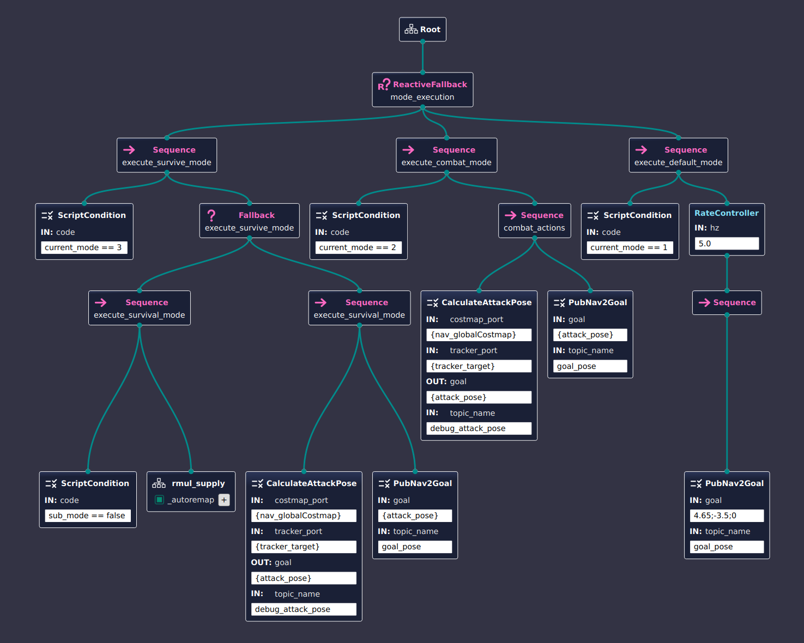
     
    
Execute

 

Execute 使用 ReactiveFallback，根据黑板里的 `current_mode` 动态切换动作分支：
（当前实现改为 Fallback，仍按优先级选择）：

- 生存模式（mode=3）：若 `sub_mode` 为 false，进入 `rmul_supply` 处理补给/保命；否则直接计算攻击位姿并下发导航目标。
- 战斗模式（mode=2）：计算攻击位姿 `CalculateAttackPose`，再发布导航目标 `PubNav2Goal` 进行追击。
- 默认模式（mode=1）：在 `RateController(5 Hz)` 下周期发布固定巡航点 `4.65;-3.5;0`，保持巡航。

Fallback 每次从最高优先级开始评估，命中即停止后续分支；模式切换会在下一次滴答立即生效。

## 7. 总结
总结一下：
- Initialize 只运行一次，确保开局状态一致；顶层的 KeepRunningUntilFailure+ForceSuccess 保证后续循环。
- ModeSelect 通过 Fallback 优先级选择模式，含生存滞回（120 进、300 出），并以子模式补充生存模式行为；若不是生存模式，则根据是否接敌确定是进入战斗模式还是底盘跟随模式。
- Execute 将当前模式映射到动作，模式切换后下一滴答立即生效。

行为树仅发布信号，不阻塞主流程。

