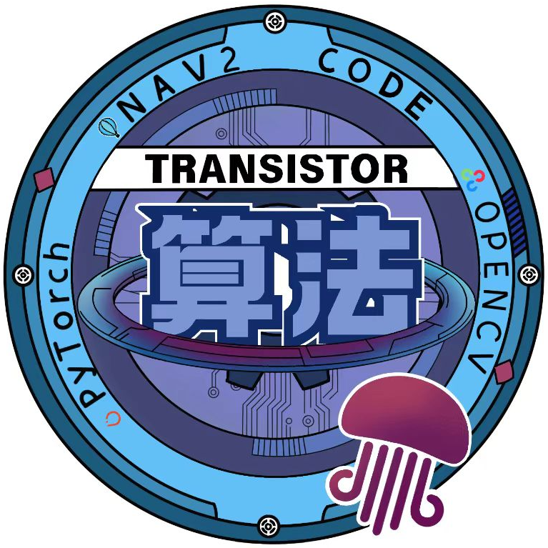

# 北极熊导航Tutorial



本教程旨在让**已经实践过Quick-Start流程**的同学学会如何调参，同时通过北极熊开源的导航功能包更加深入地理解建图、定位、导航、决策的原理和四者密不可分的关系。

本教程将长期更新。

## 0. 前言——北极熊导航包功能补全

Quick-Start中涉及到的功能包仅仅包含了建图、定位与导航的功能，不涉及任何决策，并不是北极熊导航仿真所使用的全部功能包，所以要进行补全。

### 1. 一口气全克隆

在主文件夹（``cd ~``）中执行如下指令：
```bash
git clone https://github.com/SMBU-PolarBear-Robotics-Team/pb2025_sentry_ws.git
```
```bash
cd pb2025_sentry_ws
```
```bash
vcs import --recursive . < dependencies.repos
```

上述部分将克隆北极熊战队25赛季哨兵的工作空间，其规范的文件管理让笔者叹为观止。但如果只是在自己的电脑里跑仿真，那该工作空间中``standard_robot_pp_ros2``（用来与下位机通信的）是不需要的。可以将其手动剔除或按照后续方式对快速开始部分使用的功能包补全。

北极熊导航的视觉部分提供了OpenVINO版本，若想安装请移步如下链接：

[Install OpenVINO](https://docs.openvino.ai/2025/get-started/install-openvino.html?PACKAGE=OPENVINO_BASE&VERSION=v_2025_2_0&OP_SYSTEM=LINUX&DISTRIBUTION=PIP)

上述命令建立在您使用过Quick-Start并创建了相应环境变量，如果您还在新建文件夹，建议移步下述链接看官方教程：

[More about pb2025_sentry_ws](https://github.com/SMBU-PolarBear-Robotics-Team/pb2025_sentry_ws)

### 2. 行为树

```bash
cd ~/nav2_ws
```
```bash
git clone https://github.com/SMBU-PolarBear-Robotics-Team/pb2025_sentry_behavior.git src/pb2025_sentry_behavior
```
```bash
vcs import --recursive src < src/pb2025_sentry_behavior/dependencies.repos
```
```bash
rosdepc install -r --from-paths src --ignore-src --rosdistro $ROS_DISTRO -y
```
```bash
colcon build --symlink-install --cmake-args -DCMAKE_BUILD_TYPE=release
```

上述步骤将下载并编译安装北极熊导航仿真中的行为树部分及相关依赖，有关更多信息请移步如下链接。

[More about pb2025_sentry_behavior](https://github.com/SMBU-PolarBear-Robotics-Team/pb2025_sentry_behavior)

### 3. 视觉

```bash
cd ~/nav2_ws
```
```bash
git clone --recursive https://github.com/SMBU-PolarBear-Robotics-Team/pb2025_rm_vision.git src/pb2025_rm_vision
```
```bash
vcs import --recursive src < src/pb2025_rm_vision/dependencies.repos
```
```bash
rosdep install -r --from-paths src --ignore-src --rosdistro $ROS_DISTRO -y
```
```bash
colcon build --symlink-install --cmake-args -DCMAKE_BUILD_TYPE=Release
```

上述步骤将下载并编译安装北极熊导航仿真中的视觉部分及相关依赖，有关更多信息请移步如下链接。

[More about pb2025_rm_vision](https://github.com/SMBU-PolarBear-Robotics-Team/pb2025_rm_vision)

## 1. 如何更改仿真地图

接下来将进入正式的tutorial部分。首先是如何更改仿真地图。

### 1. gazebo端

经历过Quick-Start流程的你肯定知道，gazebo端指的是``rmu_gazebo_simulator``，在该功能包下找到``config/gz_world.yaml``

```yaml
world: "rmul_2025" # 在此处修改地图

robots:
..... # 可以更改机器人的命名空间、出生点等
```

### 2. 导航端

经历过Quick-Start流程的你肯定知道，导航端改变地图是为了更改导航模式下的先验点云地图与先验二维栅格地图。我们先不定位某一个功能包，先说最简单的修改方式：在launch命令里修改。

```bash
ros2 launch pb2025_nav_bringup rm_navigation_simulation_launch.py \
slam:=False\
world:=rmul_2025 # world参数这一行就可以修改了
```

### 3. 相关文件到底存在哪里

经历过Quick-Start流程的你肯定知道，建图仿真可以保存自己建出来的点云图和二维栅格地图。实际赛场上我们很可能也要根据赛场情况，在准备时间里现场建图，那我们就很需要知道地图都保存在了哪里。

#### 1. gazebo仿真世界地图

设想一下，不久之后RM官方为了各个战队调车方便将26赛季新地图发了出来，我们就很需要知道gazebo仿真世界地图在哪里，方便我们下载好放到相应文件夹里实现新赛季的赛博调车。

其位置在``rmu_gazebo_simulator``中的``resource/model``和``resource/world``里。

#### 2. 先验点云和先验二维栅格地图

- 先验点云：``pb2025_nav_bringup``功能包中的``pcd``文件夹
- 先验栅格：``pb2025_nav_bringup``功能包中的``map``文件夹

至于保存在``reality``还是``simulation``里就要看实际需求了。